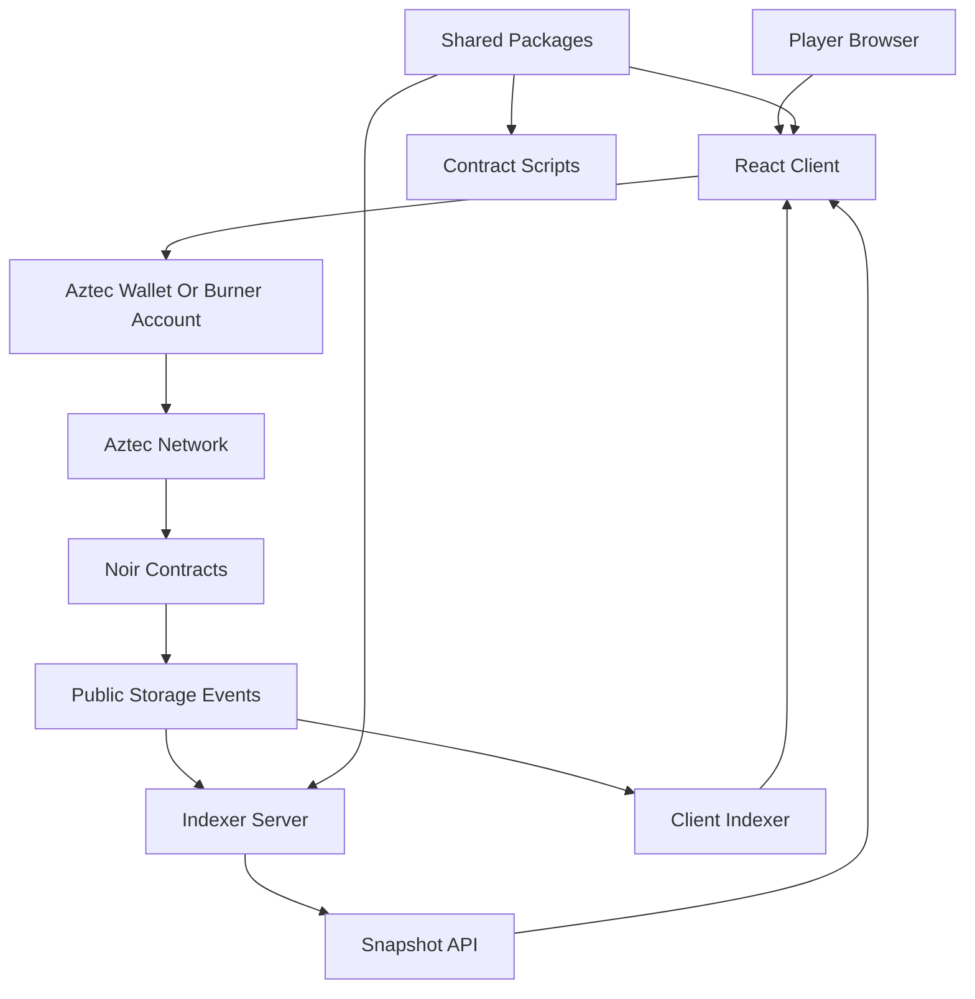
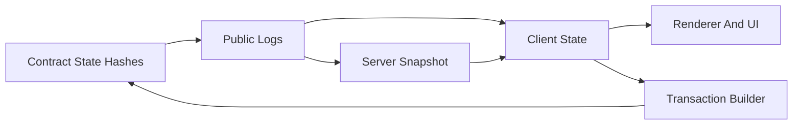

# Architecture

Dark Forest Aztec is a monorepo with three application layers and a set of shared packages:

* Aztec Noir contracts define authoritative game state transitions.
* The React client renders the game and submits private gameplay transactions.
* The indexer server rebuilds public table state and serves consistent snapshots.
* Shared `@dfpunk/*` packages keep domain types, game logic, rendering, hashing, serialization, and constants consistent across layers.

## What's Different from Dark Forest v0.6.5

| Concern              | Dark Forest v0.6.5 (Ethereum)        | Dark Forest Aztec                                 |
| -------------------- | ------------------------------------ | ------------------------------------------------- |
| Contract language    | Solidity (Diamond pattern)           | Noir, organized into storage and system contracts |
| ZK toolchain         | Circom + snarkjs (offchain proving)  | Native Aztec circuits (proving in PXE)            |
| Hash function        | MiMC                                 | Poseidon2                                         |
| Onchain state        | Full entity fields per planet/player | **Hash of entity state**; full state lives offchain |
| Private state        | Coordinate hashes only               | First-class private notes (home coords, fleet)    |
| Indexing             | TheGraph subgraph                    | Aztec public-log indexer (server + client)        |
| Account model        | EOA + relayer signatures             | Aztec account contracts / burner accounts         |

The port keeps Dark Forest's gameplay surface while moving trust onto Aztec's L2-native private execution.

## System Flow



## Contracts

Path: `contracts/`

The contracts are organized into two layers:

* `contracts/storage/`: one storage contract per entity family, such as `planet`, `player`, `artifact`, `arrival`, and `world`.
* `contracts/system/`: game actions and orchestration, including `core`, `move`, and `admin`.

The key storage design is state hash storage. Instead of storing every full entity field directly onchain, contracts store Poseidon2 hashes of entity state. Transactions pass the full state as inputs and verify it against the stored hash before applying a transition.

```text
       ┌──────────────────────────────────────────────────────┐
       │  Aztec system contract (Noir)                        │
client │                                                      │
full ──┼─▶  1. recompute Poseidon2(entity_state)              │
state  │    2. assert == onchain stored hash                 │
       │    3. apply transition with ZK constraints           │
       │    4. write new hash to public storage               │
       │    5. emit public event for indexers                 │
       └──────────────────────────────────────────────────────┘
                              │
                              ▼
              public log ─▶ indexer server / client indexer
                              │
                              ▼
              snapshot table ─▶ React renderer + game UI
```

Benefits:

* smaller onchain storage footprint;
* explicit verification of the state used by each transaction;
* compatibility with client/indexer reconstruction of full game state.

Tradeoffs:

* transaction builders must supply complete and current state inputs;
* client and server indexers must keep table conversion logic accurate;
* schema changes require careful artifact, indexer, and documentation updates.

## Client

Path: `client/`

The client owns the playable browser experience. It combines:

* React panes and views under `client/src/Frontend/`;
* game/session orchestration under `client/src/Backend/` and `client/src/Session/`;
* rendering through `@dfpunk/renderer`;
* shared domain logic through `@dfpunk/gamelogic`, `@dfpunk/types`, and related packages.

The client can bootstrap from an offchain indexer snapshot, then continue processing chain updates locally. This keeps startup fast while preserving a chain derived source of truth after the bootstrap boundary.

## Client Indexer

Path: `client/src/Session/Indexer/`

The client indexer has two layers:

* `IndexerService` manages table level state, block sync, lifecycle, and subscribers.
* `IndexerConnection` adapts that service to a domain API compatible with the old Dark Forest `EthConnection` shape.

Startup guarantee:

1. Load an optional offchain snapshot.
2. Catch up to latest known chain block.
3. Return a consistent `syncedToBlock`.
4. Notify subscribers only for blocks after that boundary.

See [client/src/Session/Indexer/README.md](../client/src/Session/Indexer/README.md) for API details and type conversion rules.

## Indexer Server

Path: `server/`

The server exists to speed up client startup and provide operational visibility. It reads public Aztec storage events, keeps typed in memory maps, writes snapshots to SQLite, and serves compressed snapshot APIs.

Main runtime flow:

1. Load contract metadata and runtime configuration.
2. Restore the last persisted snapshot from SQLite.
3. Start the HTTP API so `/health` can respond during sync.
4. Catch up from the Aztec node.
5. Build a full compressed snapshot.
6. Subscribe to incremental updates and poll for new blocks.
7. Persist snapshots on a throttle and save immediately during shutdown.

See [server/README.md](../server/README.md) for endpoint and deployment details.

## Shared Packages

Path: `packages/`

| Package                       | Purpose                                                         |
| ----------------------------- | --------------------------------------------------------------- |
| `@dfpunk/types`               | Game and contract-facing TypeScript types                       |
| `@dfpunk/contracts`           | Contract artifacts, addresses, deployment constants, ABI helpers |
| `@dfpunk/events`              | Typed pub/sub primitives (monomitter pattern)                   |
| `@dfpunk/gamelogic`           | Domain logic helpers (energy, silver, scoring)                  |
| `@dfpunk/renderer`            | WebGL renderers for planets, voyages, overlays                  |
| `@dfpunk/hashing`             | Poseidon2 helpers and hash utilities                            |
| `@dfpunk/serde`               | Field and byte serialization between TypeScript and Noir        |
| `@dfpunk/procedural`          | Deterministic procedural map and asset generation               |
| `@dfpunk/hexgen`              | Coordinate and hex helpers                                      |
| `@dfpunk/constants`           | Game constants                                                  |
| `@dfpunk/ui`                  | Shared UI primitives                                            |
| `@dfpunk/utils`               | Aztec helpers (`unwrapSimulateResult`, move-proof validation)   |
| `@dfpunk/indexer-server-core` | Reusable indexer building blocks (`IndexerService`, sources)    |

Shared packages should not depend on application-only code from `client/` or `server/`. Keep dependency direction flowing from apps to packages.

## Data Ownership



* Contracts own authoritative state transitions.
* Public logs expose enough information for indexers to reconstruct public table state.
* The server snapshot is a performance optimization, not a replacement for chain derived sync.
* The client owns local UI state, private key/home coordinate persistence, and pending user actions.
* Shared packages own deterministic helpers and domain types.

## Environment And Configuration

Contracts:

* Copy `contracts/.env.example` to `contracts/.env`.
* Use network specific files such as `contracts/.env.testnet` with `AZTEC_NETWORK=testnet`.
* Contract scripts should use `contracts/scripts/utils/env.ts`.

Client:

* Vite environment variables use the `VITE_*` prefix.
* Connection config can come from localStorage overrides, env vars, or built in defaults.

Server:

* `AZTEC_NODE_URL` selects the Aztec node.
* `INDEXER_START_BLOCK` can override contract defaults.
* `SQLITE_PATH` controls persistence location.
* `ADMIN_TOKEN` enables the protected backup endpoint when set.

## Documentation Maintenance

When architecture changes, update this file together with the code. In particular, update the docs when:

* storage schemas or events change;
* snapshot API shapes change;
* a package boundary moves;
* a new environment variable is required;
* a user facing gameplay rule changes.
